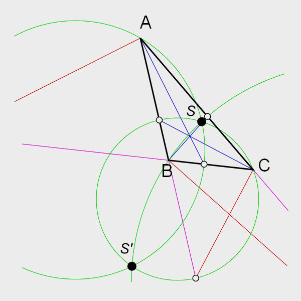
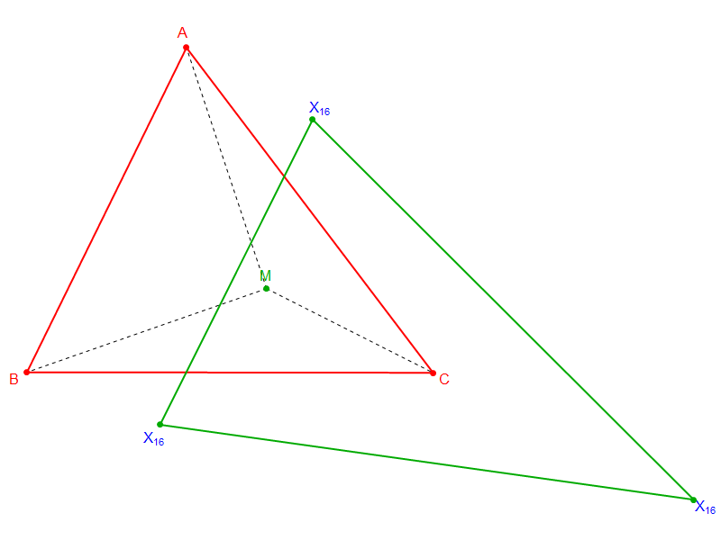
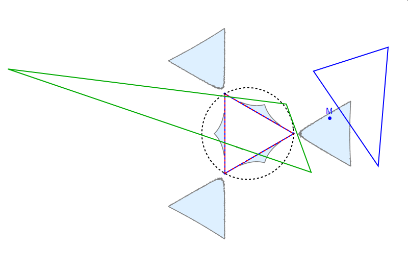
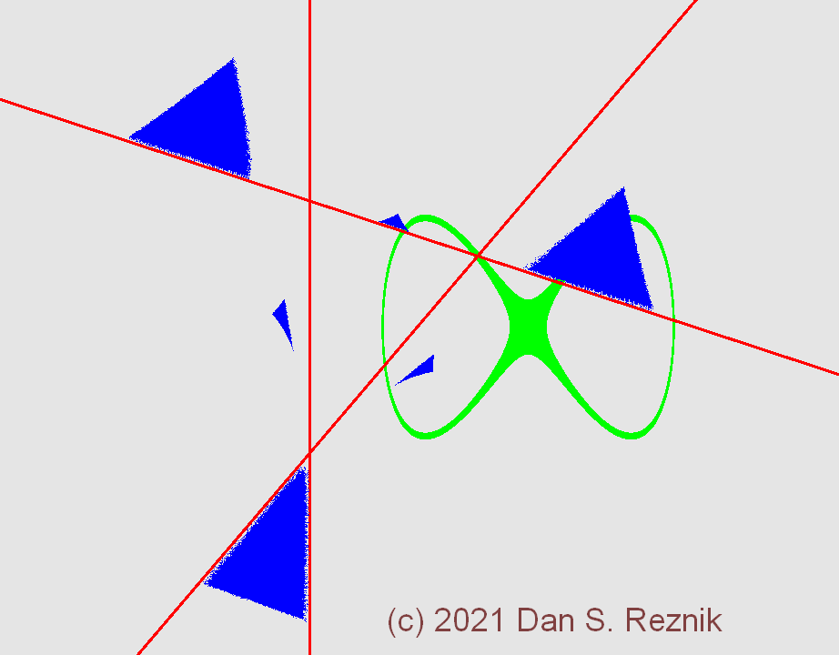

# Identity Zones of the Triple Isodynamic Map

Given a triangle T=ABC, its [isodynamic points](https://mathworld.wolfram.com/IsodynamicPoints.html) S and S' (called X(15) and X(16) in Kimberling's [ETC](https://faculty.evansville.edu/ck6/encyclopedia/ETC.html)), are the two common intersections of 3 *Apollonius* circles: each goes thru a vertex V of T and the intersection of V's internal (blue) and external (red) bisectors with the side opposite to V. For example, the first Apollonius circle goes thru A and the intersection of the internal and external bisectors of A with side BC:

Consider a triangle T=ABC (red below) and a point M (interior or exterior to T). Define the *2nd isodynamic map* as sending T to a new triangle T' (green) whose vertices are the X(16) of MBC,MCA,MAB:

After interactive exploration only possible with [Wolfram Mathematica](https://www.wolfram.com/mathematica/)'s `Manipulate[]`, we stumbled upon a curious phenomenon: given a starting T, there are several 2d bounded *zones* (light blue below) such that if M is in one of them, a thrice-applied 2nd isodynamic map returns T again, i.e., T^3 is the identity. Below T is an equilateral. Six identity zones are formed (light blue): 3 exterior "candy corns", and 3 "tents" externally pitched upon each side:

So in the example above, the equilateral is sent to the green which is sent to the blue triangle, and then back to the equilateral, forever.

Computing the identity zones with Mathematica's `RegionPlot[]` produces beautiful results but it is rather computationally expensive (minutes to hours for a single frame). Enter the world of massive GPU parallelism and the amazing [GPU.js](gpu.rocks) library, we allows one to level this power directly from browser javascript. With it we can calculate identity zones for a *moving* family of triangles at dozens of frames per second!

One frame of such an [animation](https://dan-reznik.github.io/Isodynamic-Map-GPU/) is shown below. The reference triangle is bounded by the three red lines. Its two left vertices are stationary and a third, right one moves along a lemniscate (green). The real-time computed identity zones are shown blue (the salt-and-pepper noise along its boundary is due to low precision currently available for GPU-based calculations. We hope to fix this soon).

See it [live](https://dan-reznik.github.io/Isodynamic-Map-GPU/)
